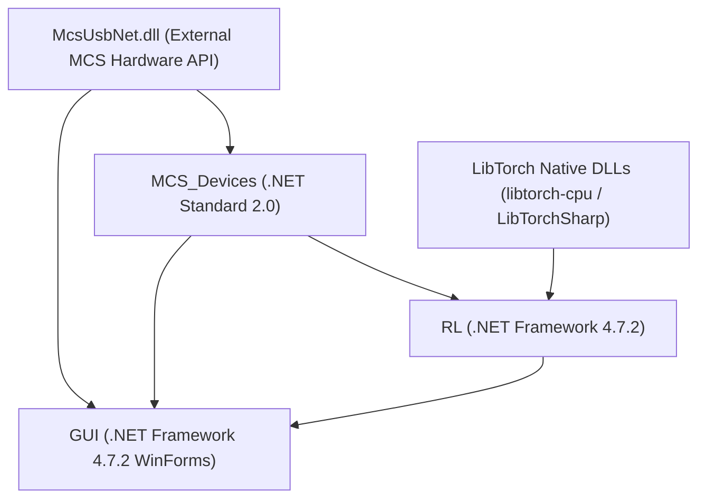

# C# MEA Control System

A closed-loop **Reinforcement Learning (RL)** control system for **Microelectrode Arrays (MEAs)** interfacing with **Multi Channel Systems (MCS)** data acquisition and stimulation hardware in C#.

The system combines high-frequency electrophysiology data acquisition, real-time electrical artifact suppression (SALPA algorithm), online spike detection, and a Deep RL agent powered by **TorchSharp** (Proximal Policy Optimization - PPO) for real-time neuromodulation control.

---

## 🏛️ System Architecture & Project Dependency Graph



```
NCN_MEA_RL_Control/
├── GUI/                      # Windows Forms GUI Application
│   ├── Form1.cs              # Main user interface & chart rendering (ScottPlot)
│   └── GUI.csproj            # WinForms UI project configuration
├── MCS_Devices/              # Hardware Interface & Signal Processing Library
│   ├── MeaDacq.cs            # Data acquisition manager & circular ring buffers
│   ├── SalpaCleaner.cs       # Real-time SALPA artifact suppression filter
│   ├── SpikeDetector.cs      # Threshold-based online spike detector
│   ├── Stimulator.cs         # STG hardware stimulation controller
│   ├── ElecIDsManager.cs     # MEA electrode mapping (60-well, 252-well)
│   ├── Filter.cs             # Digital filtering utilities
│   └── MCS_Devices.csproj    # Hardware library project
├── RL/                       # TorchSharp Reinforcement Learning Engine
│   ├── PPO.cs                # PPO Agent (Actor-Critic, Masking, Loss, Save/Load)
│   ├── Worker.cs             # Closed-loop RL orchestration worker thread
│   ├── TaskParameters.cs     # RL environment & hyperparameter definitions
│   └── RL.csproj             # RL engine project configuration
├── ElectrodeFiles/           # MEA electrode layout & pinout files
└── McsUsbNet.dll             # MCS Hardware C# .NET API assembly
```

---

## 🧩 Solution Assembly & Project Manifest

To assemble the solution from individual projects, the following components, dependencies, and project references are required:

### 1. `MCS_Devices` *(Hardware Interface & Signal Processing Library)*
* **Target Framework**: `.NET Standard 2.0` (Platform: `x64`)
* **Project Type**: Class Library
* **Key Components**: `MeaDacq.cs`, `SalpaCleaner.cs`, `SpikeDetector.cs`, `Stimulator.cs`, `ElecIDsManager.cs`, `Filter.cs`, `Thresholder.cs`
* **External Assembly Reference**: `McsUsbNet.dll` (Multi Channel Systems 64-bit C# API)

### 2. `RL` *(TorchSharp Reinforcement Learning Engine)*
* **Target Framework**: `.NET Framework 4.7.2` (Platform: `x64`)
* **Project Type**: Library / Executable
* **Project References**: Reference to `MCS_Devices.csproj`
* **Key Components**: `PPO.cs`, `Worker.cs`, `TaskParameters.cs`, `Utils.cs`
* **NuGet Packages**:
  * `TorchSharp` (v0.105.0) & `libtorch-cpu-win-x64` (v2.5.1)
  * `Google.Protobuf` (v3.31.1), `System.Text.Json` (v9.0.0), `SkiaSharp` (v2.88.9)
* **Native Runtime Binaries Required (`bin\Debug\`)**:
  * `LibTorchSharp.dll`
  * `asmjit.dll`, `c10.dll`, `fbgemm.dll`, `libiomp5md.dll`, `torch.dll`, `torch_cpu.dll`, `uv.dll`

### 3. `GUI` *(Windows Forms User Interface Application)*
* **Target Framework**: `.NET Framework 4.7.2` (Platform: `x64`)
* **Project Type**: Windows Forms Executable (`WinExe`)
* **Project References**: Reference to `MCS_Devices.csproj` and `RL.csproj`
* **Key Components**: `Form1.cs`, `Form1.Designer.cs`, `Program.cs`
* **External References & Packages**:
  * `McsUsbNet.dll`
  * `ScottPlot.WinForms` (v5.0.55) & `ScottPlot`
  * `Microsoft-WindowsAPICodePack-Shell` & `Core` (v1.1.5)
  * `OpenTK` & `OpenTK.GLControl` (v3.1.0)
* **Data Assets**: `ElectrodeFiles/` directory (`60_1_well_electrode_labels.txt`, `252_1well_electrode_labels.txt`, `MEA60_ELec_IDs_layouts.xlsx`)

---

## ✨ Key Features

### 1. High-Frequency Real-Time Acquisition (`MeaDacq.cs`)
- Connects to MCS MEA headstages (e.g., MEA60, MEA256) via `McsUsbNet.dll`.
- Decodes 64-bit continuous hardware timestamps with overflow wraparound handling.
- Thread-safe circular ring buffer supporting real-time streaming to disk, display, and online processing.

### 2. SALPA Artifact Cleaning (`SalpaCleaner.cs`)
- Implements the **Suppression of Artifacts from Local Polynomial Approximation (SALPA)** algorithm (Wagenaar et al. 2002).
- Uses per-channel `LocalFitChannel` state machines (`OK`, `PEGGING`, `PEGGED`, `TOOPOOR`, `BLANKDEPEG`, `DEPEGGING`).
- Zero-latency look-ahead pegging and hardware sync rising-edge triggers to blank stimulation artifacts without distorting neural action potentials.

### 3. Deep Reinforcement Learning Agent (`PPO.cs`)
- **Proximal Policy Optimization (PPO)** built on **TorchSharp** (C# bindings for LibTorch).
- Separate Actor and Critic deep neural networks with Mish activation functions.
- **Electrode Action Masking (`ignoreElectrodes`)**: Automatically masks out excluded electrodes.
- **Checkpoint Serialization**: Save and load model state dictionaries to/from JSON (`SaveAgent` / `LoadAgent`).

### 4. Closed-Loop Execution Worker (`Worker.cs`)
- Operates a closed-loop control loop: extracts state features from MEA activity, queries PPO agent for action selection, triggers hardware stimulation via `Stimulator.cs`, measures reward, and executes PPO optimization steps.

---

## 🛠️ Prerequisites & Setup

### Requirements
- **Operating System**: Windows 10/11 (64-bit)
- **Frameworks**: .NET Framework 4.7.2 / .NET 6.0 SDK
- **Hardware Drivers**: Multi Channel Systems USB drivers (`McsUsbNet.dll`)

### Build Dependencies
- **TorchSharp** (v0.105.0) & **libtorch-cpu-win-x64** (v2.5.1)
- **ScottPlot** (v5.0.55)

---

## 🚀 Building & Running

### Building the Solution
To build the solution using the .NET CLI:
```powershell
dotnet build NCN_MEA_RL_Control.sln
```

### Assembly Steps in Visual Studio
1. Set the target architecture to **`x64`** in Visual Studio Configuration Manager.
2. Build `MCS_Devices` project first, followed by `RL`, and finally `GUI`.
3. Launch the WinForms GUI application (`GUI/bin/Debug/GUI.exe`).

---

## 📄 License & Contact
Developed for closed-loop neuromodulation and reinforcement learning control of neuronal cultures.

Questions/Support regarding installing and running the code: NCN Lab, pauloaguiar@i3s.up.pt