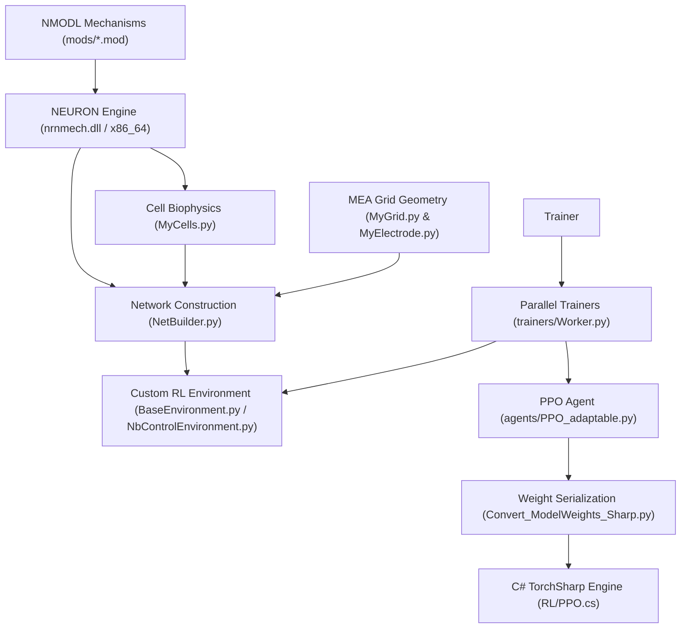

# Python Simulation & DRL Framework

A biophysical **NEURON** simulation framework and **Deep Reinforcement Learning (DRL)** platform for closed-loop control of cultured neuronal networks on **Microelectrode Arrays (MEAs)**.

This Python package models multi-compartmental biophysical neurons, microelectrode spatial geometry, extracellular stimulation/recording, dynamic synaptic plasticity, and closed-loop PPO (Proximal Policy Optimization) agents. It supports multi-core parallel training, baseline benchmarking, mechanism validation, and exporting trained agent weights for real-time C#/TorchSharp hardware execution.

---

## 🏛️ System Architecture & Dataflow



```
Python/
├── MyCells.py                                  # Biophysical neuron models & morphology (NEURON)
├── MyElectrode.py                              # MEA electrode geometry, stimulation & LFP/spike recording
├── MyGrid.py                                   # Spatial electrode grid layout generator
├── MyUtils.py                                  # Spike detection, IFR estimation, analysis & publication plotting
├── NetBuilder.py                               # Network synthesis & synaptic connectivity generator
├── generalist_PPO_hidden=1_size=32.pth         # Pre-trained PPO agent weights (PyTorch state dict)
├── generalist_PPO_hidden=1_size=32.json        # Serialized weights (JSON format for TorchSharp/C#)
├── nrnmech.dll                                 # Compiled NMODL mechanisms DLL (Windows 64-bit)
├── requirements.txt                            # Python package dependencies manifest
├── agents/                                     # DRL Agent architectures & weight converters
│   ├── PPO_adaptable.py                        # Flexible PPO agent (Actor-Critic, Mish, Masking)
│   ├── Convert_ModelWeights_Sharp.py           # PyTorch to C#/TorchSharp JSON weight converter
│   └── Convert_ModelWeights_json_to_pth.py     # JSON to PyTorch state dict converter
├── environments/                               # Custom NEURON RL environment wrappers
│   ├── BaseEnvironment.py                      # Base RL environment wrapper for NEURON simulation
│   ├── NbControlEnvironment.py                 # Network burst & activity control environment
│   └── Generate_EnvironmentConfigs.py          # Parametric configuration builder for environments
├── trainers/                                   # Multiprocessing parallel training orchestration
│   └── Worker.py                               # PyTorch multiprocessing parallel rollout worker
├── examples/                                   # Execution, testing & benchmarking scripts
│   ├── Test_Baseline.py                        # Baseline simulation, IFR analysis & connectivity plotting
│   └── Test_Generalist.py                      # Pre-trained generalist PPO agent evaluation script
├── figures/                                    # Generated figures & output visualization plots
│   ├── Baseline_Elec_Trace.png                 # Extracellular field potential traces
│   ├── Baseline_FR_Exc.png                     # Excitatory neuron firing rate distribution
│   ├── Baseline_FR_Inh.png                     # Inhibitory neuron firing rate distribution
│   ├── Baseline_Raster.png                     # Network spike raster plot
│   ├── Baseline_Raster_SpikeSorted.png         # Spike-sorted MEA electrode raster
│   ├── Baseline_Raster_with_IFR.png            # Electrode raster with Instantaneous Firing Rate
│   ├── Env_Grid.png                            # MEA electrode grid & spatial neuron layout
│   ├── Env_Grid_Hubs.png                       # Spatial degree maps & hub connectivity
│   └── Generalist_Worker_Run_Result.png        # Generalist PPO closed-loop run raster & IFR
└── mods/                                       # NMODL mechanism source code (.mod files)
    ├── AMPA_DynSyn.mod                         # AMPA dynamic synapse with short-term plasticity
    ├── NMDA_DynSyn.mod                         # NMDA dynamic synapse (voltage-dependent Mg block)
    ├── GABAa_DynSyn.mod                        # GABA_A inhibitory dynamic synapse
    ├── GABAb_DynSyn.mod                        # GABA_B inhibitory dynamic synapse
    ├── exp2nmdar.mod                           # Double-exponential NMDA receptor mechanism
    ├── hh2.mod                                 # Modified Hodgkin-Huxley ionic channel kinetics
    ├── iCaAN.mod                               # N-type calcium channel current
    ├── iCaL.mod                                # L-type calcium channel current
    ├── iKCa.mod                                # Calcium-activated potassium channel current
    ├── CaIntraCellDyn.mod                      # Intracellular calcium concentration dynamics
    ├── OU_Conductance.mod                      # Ornstein-Uhlenbeck conductance background noise
    ├── OU_Noise.mod                            # Ornstein-Uhlenbeck current noise model
    └── x86_64/                                 # Compiled NMODL library binary directory (Linux)
```

---

## 🧩 Component & Directory Manifest

### 1. Root Simulation Core
* **`MyCells.py`**: Multi-compartmental biophysical cell definitions (Pyramidal excitatory neurons, GABAergic interneurons) implementing Hodgkin-Huxley currents, calcium dynamics, and NEURON `NetCon` spike recorders.
* **`MyElectrode.py`**: Simulates point-source electrical stimulation pulses, dynamic pulse injection into target synapses, and extracellular local field potential (LFP) / spike recordings.
* **`MyGrid.py`**: Generates 2D spatial layouts for multi-well Microelectrode Arrays (e.g., 60-channel, 252-channel grids) with variable electrode spacing, radii, and impedance distributions.
* **`NetBuilder.py`**: Constructs biophysical neural networks, distributing cell populations across MEA wells, connecting cells with distance-dependent connectivity, and initializing dynamic synapses.
* **`MyUtils.py`**: Signal processing utilities for online/offline spike detection, burst detection, Instantaneous Firing Rate (IFR) estimation, publication-style formatting (`set_pub_style`), and statistical visualization.

### 2. NMODL Custom Mechanisms (`mods/`)
C-like NMODL (`.mod`) files describing ion channels, calcium dynamics, and dynamic synapses compiled for NEURON:
* **Dynamic Synapses**: `AMPA_DynSyn.mod`, `NMDA_DynSyn.mod`, `GABAa_DynSyn.mod`, `GABAb_DynSyn.mod` (implementing short-term synaptic depression and facilitation).
* **Ion Channels & Calcium**: `hh2.mod`, `iCaAN.mod`, `iCaL.mod`, `iKCa.mod`, `CaIntraCellDyn.mod`.
* **Background Stochastic Noise**: `OU_Conductance.mod`, `OU_Noise.mod` (Ornstein-Uhlenbeck processes for in vivo-like background activity).
* **Precompiled Binaries**: `nrnmech.dll` (Windows 64-bit) and `mods/x86_64/` (Linux).

### 3. Reinforcement Learning Framework (`agents/` & `environments/`)
* **`PPO_adaptable.py`**: PyTorch implementation of Proximal Policy Optimization (PPO) featuring separate Actor and Critic networks, Mish activations, action masking for inactive electrodes, and clipped surrogate loss.
* **`BaseEnvironment.py`**: Custom RL environment wrapper for NEURON network simulations, managing simulation stepping (`h.fadvance()`), observation extraction, action mapping to electrode pulses, and reward calculation.
* **`NbControlEnvironment.py`**: Specialized environment subclass for closed-loop network burst and firing rate control.
* **`Generate_EnvironmentConfigs.py`**: Utility script to generate parametric JSON configurations for multi-condition environment training.
* **Interoperability Converters**:
  * `Convert_ModelWeights_Sharp.py`: Exports PyTorch model parameters (`.pth`) to structured `.json` files compatible with TorchSharp (C#).
  * `Convert_ModelWeights_json_to_pth.py`: Converts JSON serialized weights back into PyTorch `.pth` state dicts.

### 4. Parallel Training Orchestration (`trainers/`)
* **`Worker.py`**: Implements PyTorch `mp.Process` multiprocessing workers for parallel trajectory collection across multiple CPU cores, supporting "random", "specialist", "generalist", and "efficient_random" training regimes.

### 5. Examples & Benchmarking (`examples/`)
* **`Test_Baseline.py`**: Runs baseline network activity simulations, generates spatial MEA grid layouts and degree maps, detects network bursts, computes Instantaneous Firing Rates (IFR), and exports plots to `figures/`.
* **`Test_Generalist.py`**: Evaluates the pre-trained generalist PPO model (`generalist_PPO_hidden=1_size=32.pth`) using the `Worker` engine, rendering electrode spike rasters alongside network IFR and saving plots to `figures/`.

### 6. Visualization & Figure Assets (`figures/`)
Contains figure artifacts generated by evaluation and benchmarking runs:
* `Env_Grid.png` & `Env_Grid_Hubs.png`: MEA spatial layout, cell placement, and degree/hub connectivity maps.
* `Baseline_Raster.png`, `Baseline_Raster_SpikeSorted.png`, `Baseline_Raster_with_IFR.png`: Baseline network rasters and IFR traces.
* `Baseline_FR_Exc.png` & `Baseline_FR_Inh.png`: Firing rate distribution histograms for excitatory and inhibitory populations.
* `Baseline_Elec_Trace.png`: Single-electrode extracellular voltage and burst detection traces.
* `Generalist_Worker_Run_Result.png`: Closed-loop generalist agent run showing MEA electrode rasters, stimulation events, and network IFR.

---

## ✨ Key Features

1. **Biophysical NEURON Integration**: Full multi-compartmental neuron models with customizable ionic channels and dynamic synaptic plasticity (AMPA, NMDA, GABA).
2. **MEA Spatial Electrophysiology**: Real 2D spatial electrode grids, distance-dependent synaptic connectivity, extracellular field potential calculation, and point-source electrical stimulation.
3. **PPO Deep RL Agent with Action Masking**: Customizable Actor-Critic networks supporting electrode action masking to exclude inactive or non-responsive channels.
4. **Multi-Core Parallel Training**: Scalable `Worker.py` process manager utilizing Python `multiprocessing` for parallel rollout collection across multiple CPU cores.
5. **Cross-Platform C#/TorchSharp Interoperability**: Seamless model export pipeline converting PyTorch weights to TorchSharp-compatible JSON for deployment in the C# WinForms hardware control system (`NCN_MEA_RL_Control/RL/PPO.cs`).

---

## 🛠️ Prerequisites & Setup

### Environment Requirements
* **Operating System**: Windows 10/11 (64-bit) or Linux (Ubuntu 20.04/22.04)
* **Python Version**: Python 3.10 or 3.11 (64-bit)
* **Compiler (for NMODL mechanism compilation)**:
  * **Windows**: Visual Studio C++ Build Tools or MinGW-w64 (via NEURON installation)
  * **Linux**: `gcc` / `g++` (`build-essential`)

### Python Dependencies (`requirements.txt`)

| Package | Version | Description |
| :--- | :--- | :--- |
| `neuron` | `8.2.7` | Core biophysical simulation engine |
| `torch` | `2.11.0` | Deep Learning & PyTorch neural networks |
| `numpy` | `2.4.2` | Array processing & numerical routines |
| `scipy` | `1.17.0` | Signal processing, filtering & scientific computing |
| `pandas` | `3.0.0` | Dataframes & metric logging |
| `scikit-learn` | `1.9.0` | Feature extraction & machine learning utilities |
| `matplotlib` | `3.10.8` | Scientific plotting & visualization |
| `seaborn` | `0.13.2` | Statistical data visualization |
| `statsmodels` | `0.14.6` | Statistical modeling & time-series analysis |
| `psutil` | `7.0.0` | System process & CPU core allocation management |
| `tqdm` | `4.67.3` | Progress bars for long-running simulations/training |

---

## 🚀 Installation & Build Guide

### Step 1: Create a Virtual Environment

#### On Windows (PowerShell):
```powershell
python -m venv venv
.\venv\Scripts\Activate.ps1
```

#### On Linux / macOS:
```bash
python3 -m venv venv
source venv/bin/activate
```

### Step 2: Install Python Dependencies & NEURON

NEURON can be installed directly via `pip` as listed in `requirements.txt`:

```bash
pip install --upgrade pip
pip install -r requirements.txt
```

> [!NOTE]
> `pip install neuron==8.2.7` installs the NEURON Python package along with the `nrnivmodl` mechanism compiler executable.

### Step 3: Set Up C/C++ Compiler Toolchain for NMODL

To compile custom `.mod` mechanism files (`AMPA_DynSyn.mod`, `hh2.mod`, etc.) into executable binaries, NEURON requires a C/C++ compiler toolchain:

* **Windows**:
  1. Install **Visual Studio C++ Build Tools** (Desktop development with C++) or **MinGW-w64**.
  2. Alternatively, install the official standalone [NEURON Windows Installer](https://neuron.yale.edu/neuron/download) which bundles the `mknrndll` / `nrnivmodl` GUI utility.
* **Linux (Ubuntu / Debian)**:
  ```bash
  sudo apt-get update
  sudo apt-get install -y build-essential python3-dev
  ```
* **macOS**:
  ```bash
  xcode-select --install
  ```

### Step 4: Compile NMODL Mechanisms

NEURON requires custom `.mod` files in the `mods/` directory to be compiled into a shared library:

#### On Windows:
Open PowerShell inside your virtual environment, or use the **NEURON terminal / mknrndll** GUI utility:
```powershell
cd mods
nrnivmodl
```
This generates `nrnmech.dll`. Ensure `nrnmech.dll` is located in the `Python/` root directory (or inside `mods/`).

#### On Linux / macOS:
```bash
cd mods
nrnivmodl
```
This compiles the mechanisms and creates the `x86_64/` (or `arm64/`) directory containing the binary `special` library.

---

## 💻 Usage & Execution Examples

### 1. Running Baseline Simulation & Network Analysis
Simulates baseline network activity, plots spatial MEA layouts, cell firing rate distributions, and network IFR traces:
```bash
python examples/Test_Baseline.py
```

### 2. Evaluating a Pre-Trained Generalist Agent
Runs a closed-loop simulation of the pre-trained PPO agent (`generalist_PPO_hidden=1_size=32.pth`) using `Worker.run()`, generating electrode rasters and IFR plots:
```bash
python examples/Test_Generalist.py
```

### 3. Exporting Trained Weights to C# / TorchSharp
To export a trained PyTorch model state dictionary to TorchSharp-compatible JSON format for deployment in the C# GUI:
```bash
python agents/Convert_ModelWeights_Sharp.py
```

---

## 📄 License & Contact
Developed for closed-loop neuromodulation and reinforcement learning control of cultured neuronal networks on MEA hardware.

Questions/Support regarding installing and running the code: NCN Lab, pauloaguiar@i3s.up.pt
